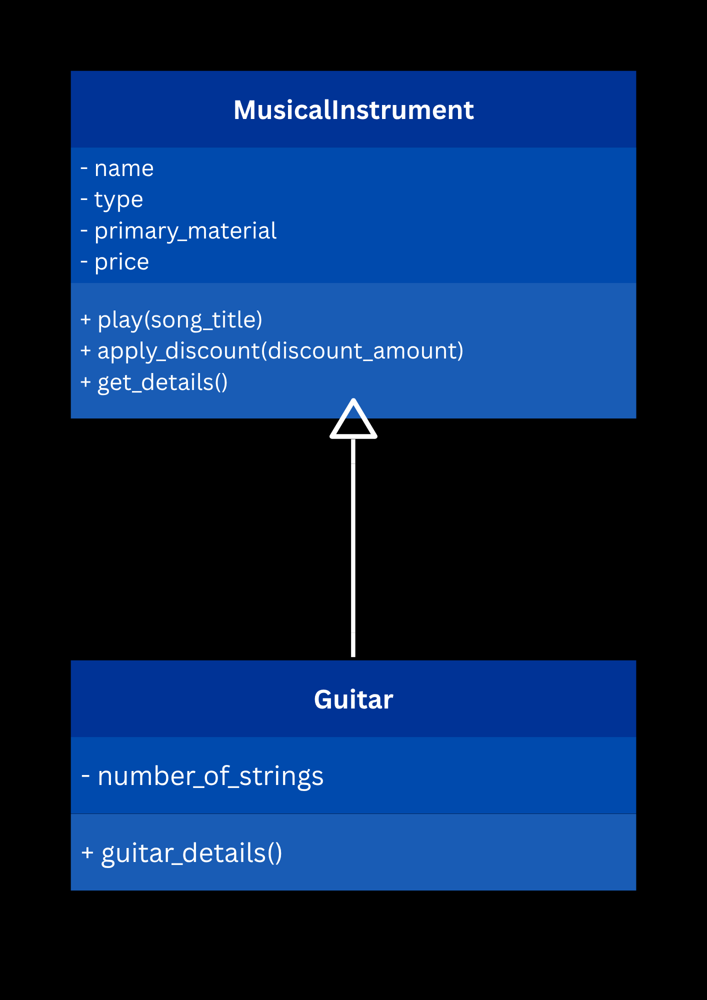
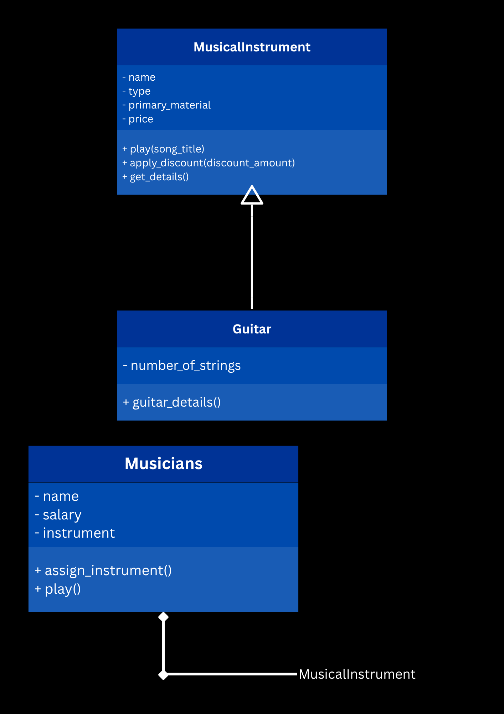
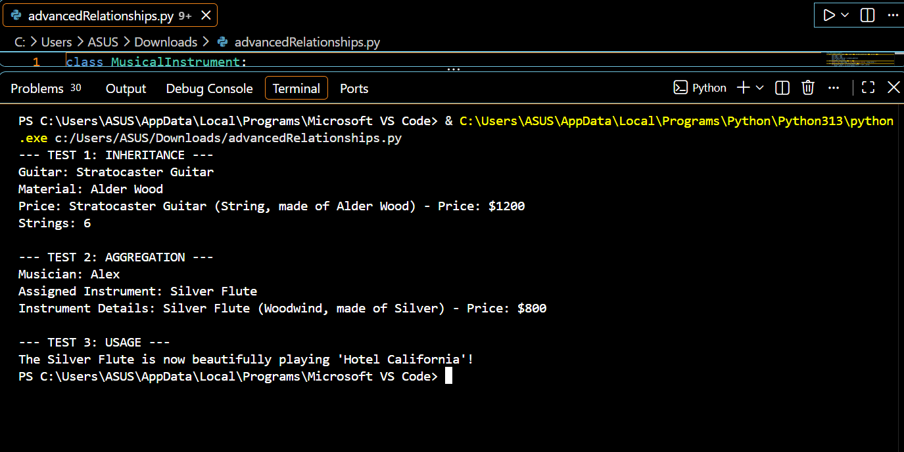
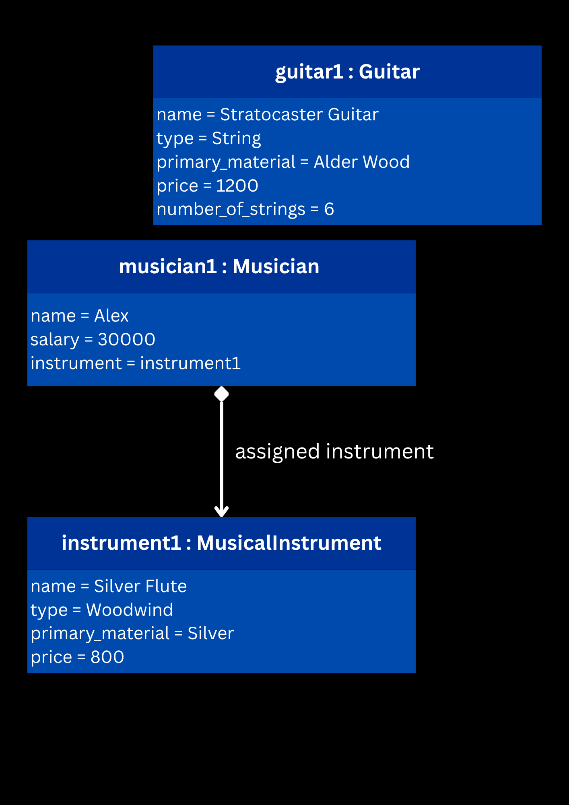

# Advanced Class Relationships
## Previous Activities
- [classAttrib](classAttributesMethods.md)
- [classRel](classRelationships.md)
## Existing System Description:
- There are two connected classes: Musician and MusicalInstrument. MusicalInstrument stores information about instruments, while Musician stores information about musicians and their assigned instruments. Musician can have and play many musical instruments.
## Inheritance Relationship
- Parent: MusicalInstrument
- Child: Guitar
- Explanation: Guitar is a child class of MusicalInstrument because it inherits the common attributes and methods from it, while also adding a specific data only for guitar, such as the number of strings.
## Inheritance UML

## Composition/Aggregation
- Relationship: Aggregation
- Explanation: A musician can have a musical instrument, but the musical instrument can still exist independently from the musician. For me, the instrument is created first and then assigned to the musician.
## Advanced UML Diagram

## Python Implementation
[Source Code](advancedRelationships.py)
## Test Run

## Object Diagram

## Reflection
1. Why did you choose your inheritance relationship? Explain why your child class is a type of your
parent class.
- 
2. How did inheritance reduce duplicate code? Identify attributes or methods that were reused.
- 
3. Why is your HAS-A relationship Composition or Aggregation? Explain the lifecycle relationship
between the two objects.
- 
4. What is the difference between Association from Part III and the advanced relationship you
implemented?
- 
5. How does your design follow the DRY principle?
- 
