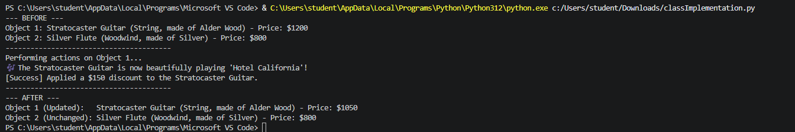
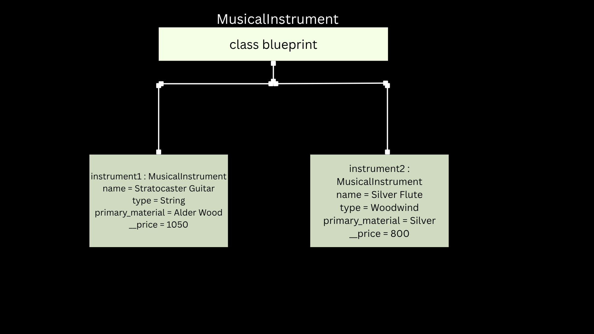

# Class Attributes and Methods
## Previous Design
Link to my previous activity:
[classObjectUML.md](classObjectUML.md)
## Design Revision
No major changes were needed from my original design.
## Visibility Decisions
| Attribute | Data Type | Visibility | Reason |
|---|---|---|---|
| name | str | public | The instrument's name can be viewed by anyone. |
| type | str | private | The type should only be changed through class methods. |
| primary material | str | private | The material is an internal property that should be protected. |
| price | int | public | The price can be viewed directly by users. |
## Updated UML Class Diagram
.png)
## Python Implementation
[View Python Source](classImplementation.py)
## Test Run

## Object Diagram

## Analysis
### Why did you make your chosen attribute private?
- I made the type and primary material private to protect the object's information. They can only be changed through class methods.
### Which method changes the state of your object?
- The apply_discount() method changes the price of the object.
### How did your two objects demonstrate that instances are independent?
- Each object has its own name, type, material, and price. Changing one object does not change the other.
### What is the difference between your class diagram and your object diagram?
- The class diagram shows the blueprint of the class. The object diagram shows the actual objects and their values.
