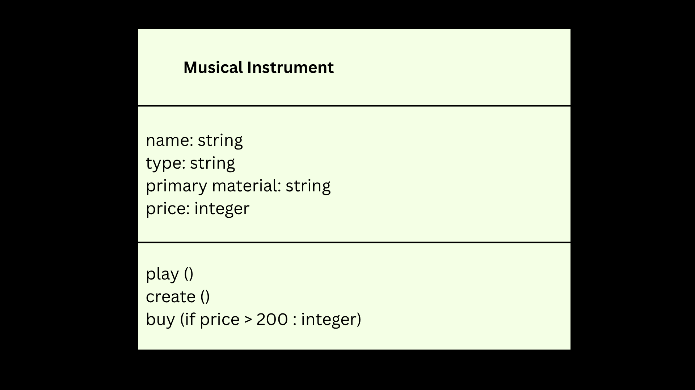

# Dexter Josue A. Parayno
# 9 - Beryllium
# SG4 - Understanding Classes and Objects
## Class Name: Musical Instrument
## Class Description: All musical instruments have their own names, types, and the way they are played.
## Properties
| Property | Data Type | Description |
|---|---|---|
| name | string | Name of musical instrument (e.g. guitar, drums) |
| type | string | Type of musical instrument (e.g. brasswind, woodwind, percussion) |
| primary material | string | The material primarily used to create the musical instrument. |
| price | integer | How much ($) the musical instrument costs |
## Methods
| Method | Description |
|---|---|
| play | Play the musical instrument. |
| create | Create the musical instrument. |
| buy | Buy the musical instrument. |

## Class Diagram

## Design Explanation
### Why did you choose this class?
I chose this class because musical instruments are so fascinating; be it pianos, guitars, drums, or triangles.  Moreover, this class can help those who want to play, buy, or create the musical instrument/s they want using the properties (name, type, primary material, and price.)
### Which property is the most important? Why?
In my perspective, the most important property is "name" because you cannot point out or distinguish musical instruments without giving them a name. For example; viola and violin; those two almost look the same, right? The name is the one that distinguishes them. It's just like giving twins different names to differentiate them.
### Which method is the most useful? Why?
For me, the most important method is "create." You cannot play and buy a musical instrument if it hasn't been created yet; you would be playing or buying nothing.
