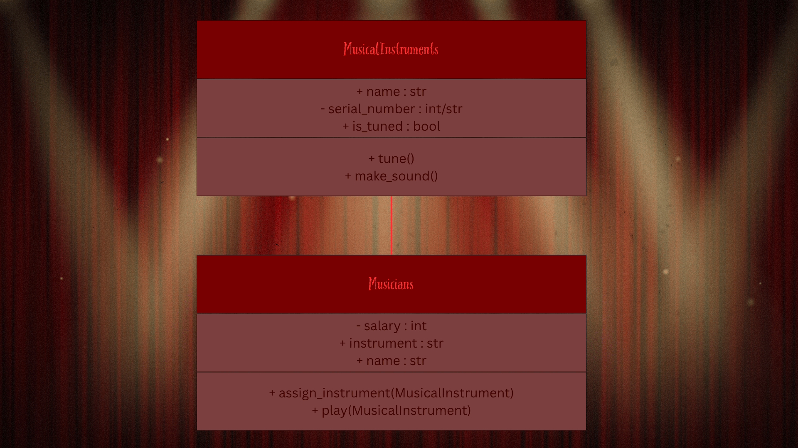
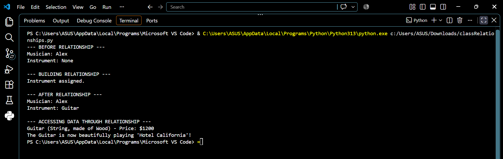
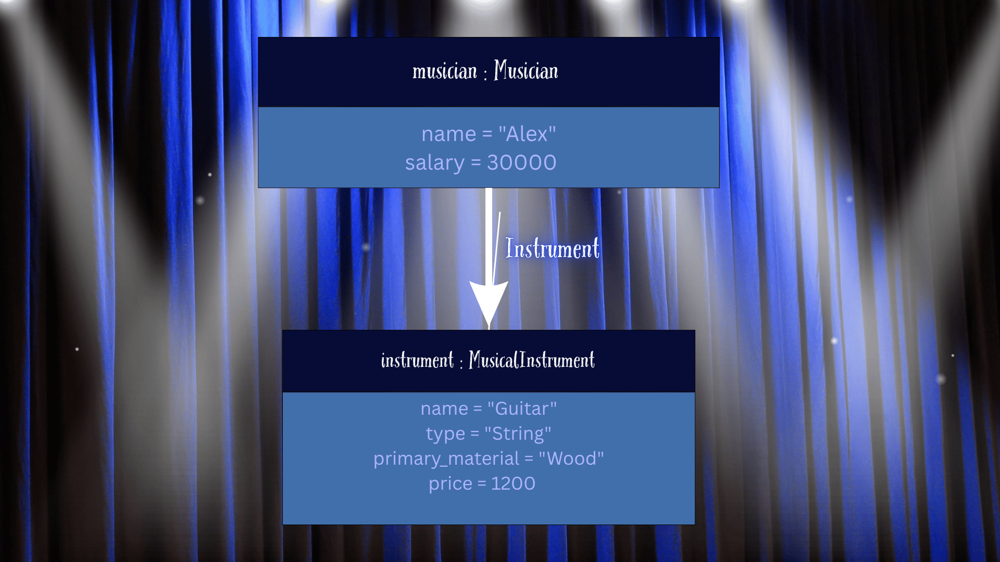

# Class Relationships: Association and Multiplicity
## Previous Work
- [Part I - Classes and Objects](classObjectUML.md)
- [Part II - Class Attributes and Methods](classAttributesMethods.md)
## Existing Class
- Class: MusicalInstruments
- Description: All musical instruments have their own names, types, and the way they are played.
## New Related Class
- Class: Musicians
- Description: Every musician has a typical instrument they use a lot in their songs and music.
## Association
- Relationship: Musicians HAS-A MusicalInstruments.
- Explanation: These two are interconnected, for every musician has at least one instrument.
## Multiplicity
- Multiplicity: many-to-many
- Explanation: A musician can play many instruments, and instrument can be played by many musicians.

## UML Class Relationship Diagram

## Python Implementation
[View Python Source](classRelationships.py)
## Test Run

## Object Relationship Diagram

## Analysis
### What is the association between your two classes?
### What multiplicity did you choose and why?
### How did you implement the relationship in Python?
### Why did you store an object reference instead of copying its data?
### If your relationship uses many, why is a list appropriate?

### LLM prompts used
- An LLM was used, source: GoogleAI 
